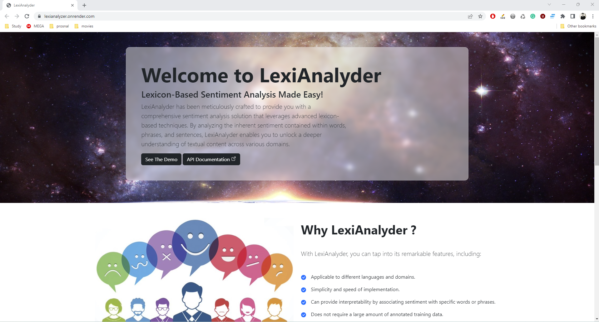
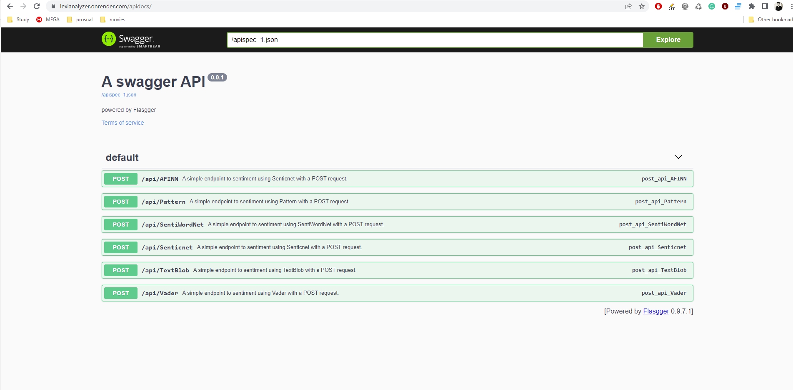
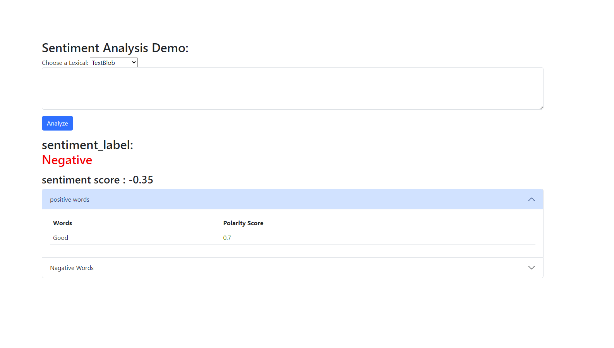

# LexiAnalyzer

---------------------
# ** Overview **
-------------------
Lexicon-based Sentiment Analysis Made Easy: Introducing LexiAnalyzer API, a powerful tool that effortlessly integrates lexicon-based sentiment analysis into your applications. With LexiAnalyzer, you can effortlessly harness the power of lexicons to analyze and understand the sentiment behind the text. Seamlessly integrate this cutting-edge API into your applications and unlock a world of sentiment analysis with ease. 
Live_Demo : https://lexianalyzer.onrender.com/

# Build API Documentation IN Swagger.

The REST API, built using Flask, offers a robust and efficient solution for handling your application's data and functionality. To enhance the API's documentation and improve its usability, Swagger was seamlessly integrated with Flask. With Swagger, developers can effortlessly explore, understand, and interact with the API, as it provides clear and comprehensive documentation. This combination of Flask and Swagger ensures a smooth development experience, empowering developers to build and interact with the API efficiently and effectively.

# Demo

We have developed a user-friendly demo page that allows users to test the API before integrating it into their applications. This demo page is designed to cater to both developers who want to evaluate the API's functionality and any user who simply wants to determine the sentiment of a paragraph. By entering a paragraph of text into the demo page, users can easily obtain the sentiment analysis results in real time. This feature enables convenient and immediate access to the API's capabilities, making it accessible to a wide range of users with varying needs.

